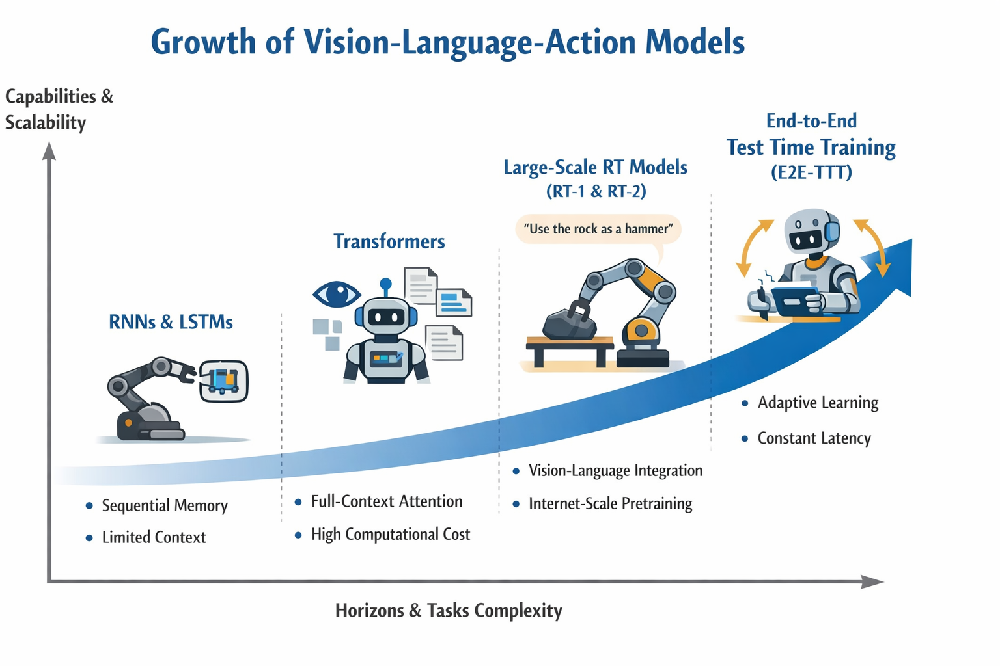

I came into robotics from software, carrying a familiar mental model. You train a model. You deploy it. Inference stays fixed. The code runs. Reality politely cooperates.

Robots disagree with this model.

This post walks through why long context robotics keeps breaking static models, how test time training reframes the problem, and why recent end to end approaches matter if you want robots that operate for hours instead of demos.

The framing stays practical. The math shows up only when it earns its keep.

## Sequence modeling before attention

Early robotics leaned on recurrence. A robot observed something, updated a hidden state, and acted. Repeat.

A vanilla recurrent neural network updates its hidden state like this:

$$
h_t = \sigma(W_{hh} h_{t-1} + W_{xh} x_t + b_h)
$$

The hidden state tries to summarize everything that mattered so far. That works for short horizons. It fails quietly for long ones.

Backpropagation through time multiplies gradients repeatedly. They shrink or explode. Long range dependencies blur. You end up tuning learning rates and hoping the task stays forgiving.

LSTMs improved this by adding gates and a persistent cell state. In robotics, this mattered. Manipulation benefited. Visual servoing stabilized. Tasks like pouring became tractable because temporal structure mattered more than raw perception.

The bottleneck stayed. Everything still compressed into a fixed vector. Training stayed sequential. GPUs waited patiently while time marched forward one step at a time.

## Attention changes the shape of memory

Transformers removed recurrence. Attention let every timestep look at every other timestep directly.

The core operation looks like this:

$$
\text{Attention}(Q, K, V) = \text{softmax}\left(\frac{QK^T}{\sqrt{d_k}}\right) V
$$

For robotics, this unlocked long horizon credit assignment. A robot could connect an early action with a late outcome without waiting for rewards to propagate slowly.

Decision Transformers pushed this further by treating reinforcement learning as sequence modeling. Feed in states, actions, and desired returns. Predict the next action. Training stabilized. Offline data became useful.

The cost arrived quietly. Attention scales quadratically with context length. Longer tasks demanded more context. Latency climbed. Memory exploded. Edge devices complained.

## Vision language action at scale

Models like RT one and RT two unified perception, language, and control. A single Transformer mapped images and instructions to actions. Internet scale pretraining leaked useful semantics into robotics. A rock could become a hammer if the context suggested it.

The price was predictable. Longer horizons multiplied attention costs. High frequency control pushed token counts up. Real time deployment drifted out of reach.

This is where the framing changes.

## The quadratic wall

Long context in robotics looks like a memory problem. Historically, the fix involved bigger windows or clever attention tricks.

Test time training reframes it as a learning problem.

Instead of asking a model to remember everything explicitly, let it adapt while it runs.

## Test time training in practice

Test time training lets a model update parts of itself during inference using a self supervised loss. The input stream becomes a training set.

For a robot, this could mean reconstructing sensor inputs to adapt to lighting shifts or calibration drift. The main task benefits indirectly because the model aligns itself to the current distribution.

The simplest form updates weights like this:

$$
W_t = W_{t-1} - \eta \nabla \ell(W_{t-1}; x_t)
$$

The weights become the memory. These are often called fast weights. They evolve as the sequence unfolds.

Complexity becomes linear in time. Latency stays flat. Expressivity increases because memory lives in parameters rather than a single vector.

## End to end test time training

Early test time training bolted adaptation onto models that were never trained to adapt. End to end test time training fixes this mismatch.

Training treats every sequence as a test sequence. An inner loop performs test time updates. An outer loop optimizes the initial weights so those updates work well.

During inference, the model keeps learning. During training, it learns how to learn during inference.

Only part of the network updates. Typically the later multilayer perceptrons. Attention, embeddings, and normalization stay fixed. The model retains its general knowledge while adapting its working memory.

Latency stays constant even as context grows. At long horizons, this outperforms full attention by a wide margin.

Precision tradeoffs remain. Tasks that require exact retrieval still favor full attention. Semantic coherence scales well with test time training.

## Why this matters for robots

Robots operate continuously. They do not reset context every few thousand tokens. They experience drift, noise, and partial observability.

Static policies assume execution matches training. When reality deviates, they fail cleanly and repeatedly.

Test time training enables adaptation without labels. Progress estimators provide dense feedback. Horizons extend gradually. Recovery emerges because the model keeps updating as the task unfolds.

Frameworks like EVOLVE VLA and TT VLA show this concretely. Robots retry. They correct trajectories. They handle novel tasks without retraining cycles.

This is not magic. It is continual learning constrained carefully enough to stay stable.

## Memory as learning

A useful way to think about this shift is memory through learning.

Recent observations live in explicit attention windows. Distant context compresses into parameters. Local precision pairs with global semantics.

This mirrors how humans operate. Immediate perception stays sharp. Long term context stays compressed and meaningful.

## Open problems

Hardware utilization remains tricky. Backpropagation overhead dominates unless updates batch across large chunks. Stability matters. Updating too much invites forgetting. Updating too little limits adaptation.

Security enters the picture. If a robot learns from inputs, those inputs can attack the learning process. Filters and safeguards become necessary.

These problems look solvable. They look engineering shaped rather than conceptual.

## Closing thoughts

Long context robotics stopped being a pure architecture problem. It became a question of when learning happens.

End to end test time training treats deployment as part of training. Models arrive pre initialized to adapt rather than frozen in place.

For software engineers entering robotics, this framing feels familiar. Systems evolve while they run. State lives where it is useful. Assumptions update continuously.

Robots finally agree.

Sources:
- [End-to-End Test-Time Training for Long Context](https://arxiv.org/pdf/2512.23675)
- [Decision Transformer: Reinforcement Learning via Sequence Modeling](https://arxiv.org/pdf/2106.01345)
- [Steering Decision Transformers via Temporal Difference Learning](https://cpsl.pratt.duke.edu/files/docs/d2t2.pdf)
- [RT-2: Vision-Language-Action Models](https://robotics-transformer2.github.io/)
- [Learning to (Learn at Test Time)](https://arxiv.org/html/2310.13807)
- [Test-Time Training (TTT): A Comprehensive Exploration of Its Theory, Applications, and Future Implications](https://medium.com/@sampan090611/test-time-training-ttt-a-comprehensive-exploration-of-its-theory-applications-and-future-46a934481782)
- [Test-Time Training on Video Streams](https://www.jmlr.org/papers/volume26/24-0439/24-0439.pdf)
- [EVOLVE-VLA: Test-Time Training from Environment Feedback for Vision-Language-Action Models](https://arxiv.org/pdf/2512.14666)
- [Test-Time Training Done Right](https://arxiv.org/pdf/2505.23884v1)