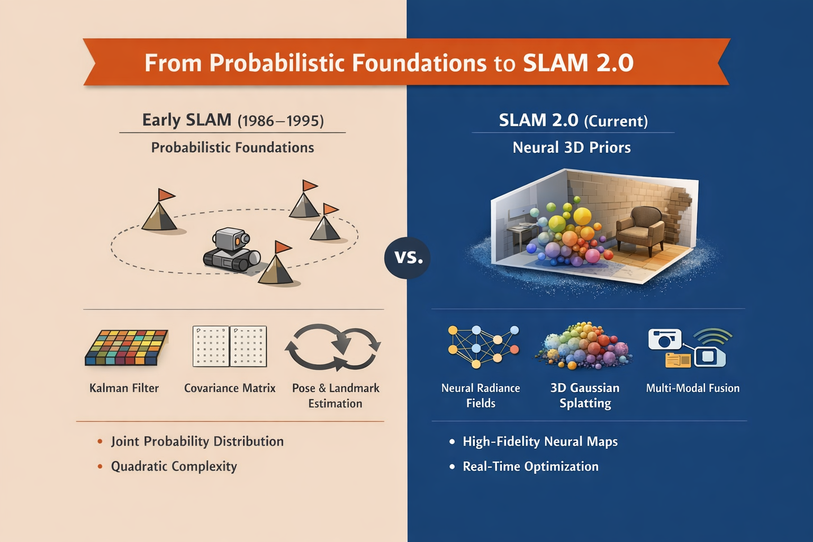

The field of Simultaneous Localization and Mapping, commonly referred to as SLAM, has evolved from a theoretical construct in the mid 1980s into a core component of modern autonomous systems. At its core, SLAM defines the problem of enabling an autonomous agent to construct a representation of an unknown environment while simultaneously estimating its own pose within that representation. The difficulty arises from a circular dependency. Accurate mapping depends on precise localization, and precise localization depends on an accurate map. Over four decades, the field has addressed this dependency through successive methodological shifts, beginning with probabilistic filtering, progressing through global optimization, and arriving at neural geometric priors and implicit scene representations.

## Probabilistic Foundations from 1986 to 1995

The mathematical structure of SLAM first emerged at the 1986 IEEE Robotics and Automation Conference. Prior work treated navigation and mapping as separate problems. Smith and Cheeseman demonstrated that landmark position estimates become correlated through shared uncertainty in robot pose. This result established that a consistent solution requires maintaining a full joint probability distribution over both robot state and environmental features.

During this period, the Extended Kalman Filter became the dominant approach. EKF based systems maintained a state vector that included robot pose and all observed landmarks, along with a covariance matrix encoding uncertainty and cross correlation. This formulation worked for small environments but introduced a quadratic computational cost relative to the number of landmarks. As environments grew, real time operation became impractical.

## Scalability and Particle Filtering from 1995 to 2005

Limitations in EKF scalability motivated alternative probabilistic formulations. The Rao Blackwellized Particle Filter emerged as a practical solution, with FastSLAM as its most prominent implementation. FastSLAM decomposed the SLAM posterior into a localization component handled by a particle filter and a mapping component where each particle maintained independent landmark estimators.

This decomposition relied on the insight that known robot trajectories render landmark estimates conditionally independent. By sampling trajectories with particles, FastSLAM reduced computational complexity and enabled large scale mapping. Tree based data structures further reduced update costs by limiting computation to observed landmarks. The particle framework also addressed data association ambiguity through resampling, as particles encoding incorrect associations naturally lost weight.

## Optimization and Factor Graphs from 2005 to 2015

A third shift replaced filtering with global optimization. Smoothing and Mapping methods formulated SLAM as a nonlinear least squares problem over a factor graph. Nodes represented robot poses and landmarks. Factors encoded constraints from odometry and sensor observations.

This formulation enabled robust handling of loop closures. When a system recognized a previously visited location, it added a constraint between distant poses. Optimization redistributed error across the entire trajectory, correcting accumulated drift. Sparsity played a central role. Since observations are local, the information matrix remained sparse. Incremental solvers such as iSAM2 exploited this structure through Bayes Trees, enabling real time updates in large environments.

## Visual SLAM and Photometric Consistency

As optimization matured, attention shifted toward camera based systems. Visual SLAM leveraged the high information density of images and evolved along two lines.

Feature based systems extracted keypoints and descriptors, then matched them across frames to estimate motion and structure. Systems such as PTAM and ORB SLAM achieved robust sparse mapping and became standard in many applications.

Direct methods operated on raw pixel intensities. Systems such as LSD SLAM and DSO minimized photometric error directly and produced semi dense maps. These methods captured more geometry but required stable illumination and high frame rates.

The fusion of cameras with inertial sensors resolved scale ambiguity and improved robustness. Visual Inertial SLAM became a standard configuration for mobile platforms.

## Dynamic Environments and the Static World Assumption

Most classical SLAM systems assumed static environments. In real scenes, moving objects violate this assumption and corrupt data association. Early approaches relied on robust loss functions and geometric outlier rejection. These methods struggled when dynamic objects dominated the scene.

Deep learning enabled semantic SLAM. Systems applied object detection or segmentation to identify potentially dynamic regions and exclude them from optimization. This approach improved pose estimation but discarded useful geometry from objects that were momentarily static.

## Dynamic Visual SLAM with a General 3D Prior

The work titled Dynamic Visual SLAM using a General 3D Prior introduced Pi3MOS SLAM. The system integrated a patch based geometric pipeline with a transformer based 3D reconstruction model.

At its core lies the pi cubed model, a permutation equivariant transformer that predicts depth, point maps, and relative poses from unordered image sets. The model operates without a fixed reference frame and encodes metric geometry.

Pi3MOS SLAM extended this model with moving object segmentation. The system distinguished camera induced motion from independent object motion through learned spatiotemporal representations.

## Uncertainty Aware Bundle Adjustment

Incoming frames paired with historical keyframes passed through the transformer to obtain depth and motion probabilities. Rather than masking dynamic regions, the system integrated these predictions into a sliding window bundle adjustment.

The optimization minimized a joint objective composed of geometric reprojection error and a depth prior term derived from the neural model. The contribution of the prior scaled according to the model’s confidence. Geometry dominated when parallax and texture were sufficient. The prior dominated when visual constraints weakened.

The implementation built on DPV SLAM, which tracked sparse patches using optical flow. This design reduced memory usage compared to dense approaches.

## Scale Consistency in Monocular Systems

Monocular systems face persistent scale ambiguity. Feed forward reconstruction models often drift in scale across batches. Pi3MOS SLAM addressed this through keyframe based scale alignment. The system computed a confidence weighted median ratio between estimated patch depths and predicted depths, then aligned the neural output to the global trajectory scale.

This mechanism preserved metric consistency over long sequences.

## Empirical Performance

Experiments across dynamic benchmarks showed substantial reductions in trajectory error relative to dense neural baselines. Performance gains arose from stable tracking under heavy occlusion by moving objects. The learned 3D prior provided a geometric scaffold that bridged gaps in visual observations.

## SLAM 2.0 and Neural Scene Representations

Current research has shifted toward high fidelity neural maps. Neural Radiance Fields represent scenes as continuous functions parameterized by neural networks. These systems generate dense reconstructions but incur high computational cost due to ray marching.

Three dimensional Gaussian Splatting offers an explicit alternative. Scenes are represented as collections of anisotropic Gaussians rendered through differentiable rasterization. These systems achieve high rendering rates and support incremental optimization.

## Foundation Models and Lifelong Mapping

Foundation models now support place recognition and semantic understanding under extreme appearance change. Large scale training enables recognition across seasons and viewpoints. Emerging 3D models support zero shot navigation by providing general geometric priors before mapping begins.

## Sensor Modalities and Fusion

LiDAR based systems provide high geometric precision and operate in low light but impose cost and size constraints. Visual systems offer semantic richness at low cost but suffer under poor lighting and motion blur. RGB D sensors provide dense depth indoors but fail outdoors.

Modern systems increasingly fuse vision, inertial sensing, LiDAR, and radar. Fusion improves robustness by allowing one modality to compensate for another under adverse conditions.

## Future Directions

SLAM increasingly serves as the spatial substrate for embodied intelligence. Integration with language models enables high level interaction grounded in geometry. Lifelong mapping systems aim to learn long term environmental dynamics rather than static layouts. Hardware aware design remains critical as neural SLAM systems migrate to edge devices.

## Conclusion

From early probabilistic correlations to transformer based 3D priors, SLAM has advanced through successive reframings of uncertainty, structure, and representation. Pi3MOS SLAM demonstrated that learned geometric priors can replace static world assumptions while preserving metric accuracy. As neural representations and optimization continue to converge, mapping and understanding increasingly collapse into a single process that supports autonomous perception and action.

Sources:
- [A Full Overview of Visual SLAM Algorithms](https://www.researchgate.net/publication/395343533_A_Full_Overview_of_Visual_SLAM_Algorithms)
- [Advances in Feed-Forward 3D Reconstruction and View Synthesis: A Survey](https://arxiv.org/pdf/2507.14501)
- [The GraphSLAM Algorithm with Applications to Large-Scale Mapping of Urban Structures](https://robots.stanford.edu/papers/thrun.graphslam.pdf)
- [Dynamic Visual SLAM using a General 3D Prior](https://arxiv.org/pdf/2512.06868)
- [DenseSplat: Densifying Gaussian Splatting SLAM with Neural Radiance Prior](https://arxiv.org/html/2502.09111)
- [TALO: Pushing 3D Vision Foundation Models Towards Globally Consistent Online Reconstruction](https://arxiv.org/html/2512.02341)